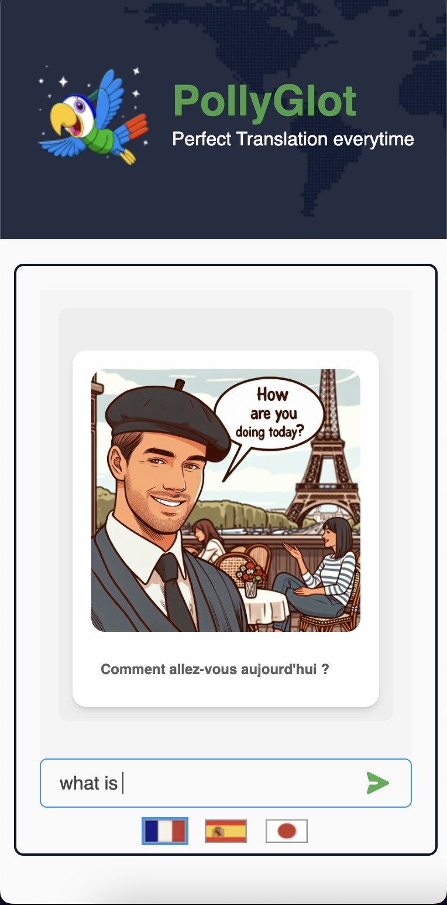

# PollyGlot - Language Translation and Image Generation

PollyGlot is a web application that allows users to translate text into a selected language and generate images based on their input. It uses OpenAI's GPT-4 and DALL·E models to provide translation and image generation functionalities. The app is built using **React** for the frontend and **Node.js with Express** for the backend.

## Features

- **Text Translation**: Users can input text and select a language to translate it into. The translation is powered by OpenAI's GPT-4 model.
- **Image Generation**: After entering the text, users can request an AI-generated image related to the input text in the selected language, using OpenAI's DALL·E model.
- **Caching**: Both translation and image generation are cached for improved performance and to reduce API calls.
- **Responsive UI**: The frontend is designed to be user-friendly and responsive, allowing seamless interaction between translation and image generation.

---

## Technology Stack

### Backend
- **Node.js**: JavaScript runtime environment for building scalable server-side applications.
- **Express**: Web framework for Node.js to handle HTTP requests and API routing.
- **OpenAI API**: Used for text translation (GPT-4) and image generation (DALL·E).
- **Node-Cache**: Caching module for caching translation and image results.
- **dotenv**: For managing environment variables.

### Frontend
- **React**: JavaScript library for building user interfaces.
- **TypeScript**: Typed superset of JavaScript used for development.
- **Axios**: Promise-based HTTP client for making API requests to the backend.
- **Tailwind CSS**: Utility-first CSS framework used for styling the components.

---

## Setup

### Prerequisites

- **Node.js**: Ensure that you have Node.js installed on your system.
- **OpenAI API Key**: You'll need to have an OpenAI API key to access the GPT-4 and DALL·E models. You can obtain the key from the [OpenAI website](https://platform.openai.com/).
- **.env file**: Create a `.env` file in the root directory and add the following variables:

```env
PORT=5000
OPENAI_API_KEY=your-openai-api-key
```

### Backend Setup

1. Clone the repository:
   ```bash
   git clone https://github.com/your-username/pollyglot.git
   cd pollyglot/backend
   ```

2. Install dependencies:
   ```bash
   npm install
   ```

3. Start the backend server:
   ```bash
   npm start
   ```

The backend will be running on the port defined in your `.env` file (default: 5000).

### Frontend Setup

1. Navigate to the frontend directory:
   ```bash
   cd ../frontend
   ```

2. Install dependencies:
   ```bash
   npm install
   ```

3. Start the frontend development server:
   ```bash
   npm start
   ```

The frontend will be running on [http://localhost:3000](http://localhost:3000).

---

## Usage

1. Open the app in your browser (Frontend will be running on `http://localhost:3000`).
2. Select a language from the **Language Selector**.
3. Type the text you wish to translate.
4. Click **Send** to generate both the translation and an AI-generated image based on the text.
5. View the translated text and image in the chat history.

---

## Folder Structure

### Backend
```
/backend
  ├── controllers
  │   └── LanguageTranslateController.ts  # Handles the translation and image generation
  ├── routes
  │   └── index.ts  # API route setup
  ├── utils
  │   └── prompts.ts  # Helper functions for generating prompts for OpenAI
  ├── .env  # Environment variables for API keys
  ├── server.ts  # Entry point for the backend server
  └── package.json  # Backend dependencies
```

### Frontend
```
/frontend
  ├── components
  │   ├── Header.tsx  # Header component
  │   ├── LanguageSelector.tsx  # Language selection component
  │   ├── ChatInput.tsx  # Text input and submit button
  │   └── ResponseCard.tsx  # Displays translated text and generated image
  ├── utils
  │   └── axios.ts  # Axios instance for API requests
  ├── App.tsx  # Main React component
  └── package.json  # Frontend dependencies
```

---

## Contributing

1. Fork the repository.
2. Clone your fork locally:
   ```bash
   git clone https://github.com/your-username/pollyglot.git
   ```
3. Create a branch for your feature or bug fix:
   ```bash
   git checkout -b feature-name
   ```
4. Make changes and commit them:
   ```bash
   git commit -m "Description of changes"
   ```
5. Push the changes to your fork:
   ```bash
   git push origin feature-name
   ```
6. Create a pull request from your forked repository to the original repository.
